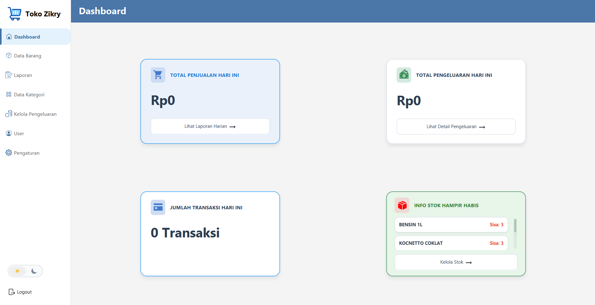
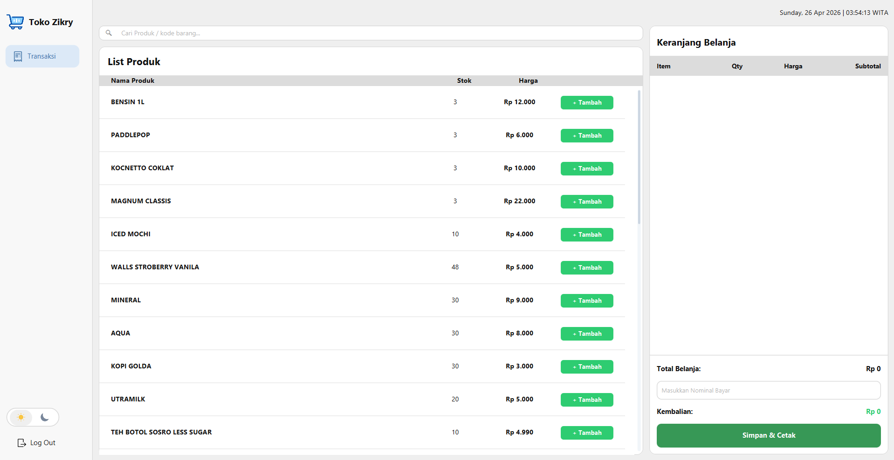
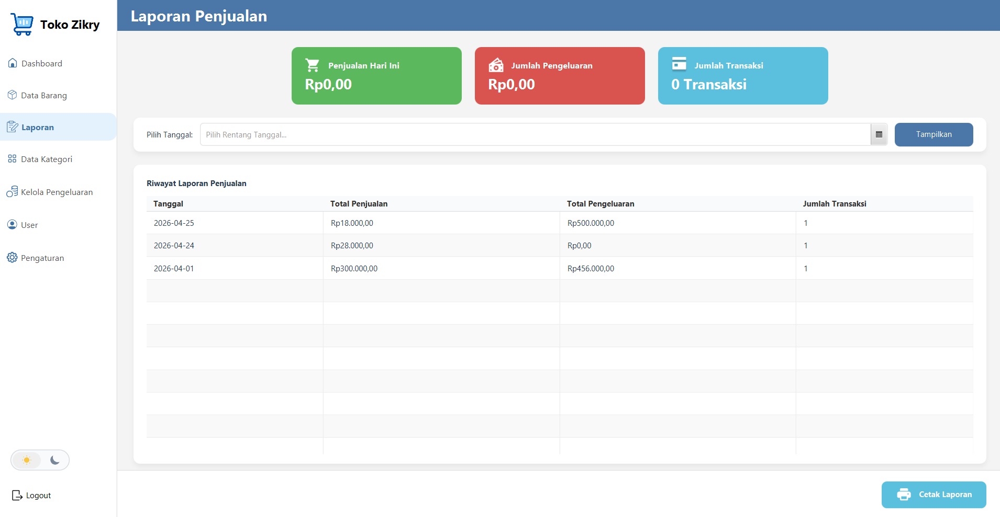

# Toko Zikry


## Daftar Isi
- [Deskripsi](#deskripsi)
- [Fitur Utama](#fitur-utama)
- [Teknologi](#teknologi)
- [Struktur Folder](#struktur-folder)
- [Cara Install](#cara-install)
- [Cara Menjalankan](#cara-menjalankan)
- [Cara Build](#cara-build)
- [Export Laporan](#export-laporan)
- [Light / Dark Mode](#light--dark-mode)
- [Role User](#role-user)
- [Screenshot](#screenshot)
- [Author / Tim](#author--tim)
- [Catatan](#catatan)

## Deskripsi
**Toko Zikry** adalah aplikasi kasir desktop berbasis **JavaFX** untuk pengelolaan transaksi, data barang, laporan penjualan, pengeluaran, kategori, dan user dengan dukungan role **kasir** serta **pemilik/admin**.

## Fitur Utama
- Login dengan session user dan role-based access.
- Dashboard kasir dan dashboard pemilik/admin.
- Manajemen data barang, kategori, user, dan pengeluaran.
- Transaksi kasir dengan keranjang belanja dan simpan/cetak.
- Laporan penjualan dengan filter tanggal.
- Export laporan ke **PDF** dan **Excel**.
- Light mode dan dark mode.
- Penggunaan database lokal **SQLite**.

## Teknologi
Versi dependency yang terbaca dari project ini:

- JavaFX Controls `21.0.6`
- JavaFX FXML `21.0.6`
- SQLite JDBC `3.53.0.0`
- Apache PDFBox `2.0.36`
- Apache POI `5.4.1`
- Maven

Catatan: versi JDK tidak dituliskan eksplisit di `pom.xml`, jadi gunakan JDK yang kompatibel dengan konfigurasi project ini.

## Struktur Folder
```text
src/main/java
|-- app
|-- config
|-- Controller
|-- DAO
|-- model
`-- util

src/main/resources
|-- FXML
|-- CSS
`-- Images

database
`-- umkm.db
```

## Cara Install
1. Clone repository ini.
2. Buka project di IntelliJ IDEA atau IDE Java lain yang mendukung Maven.
3. Pastikan file database tersedia di `database/umkm.db`.
4. Jalankan Maven Wrapper atau Maven bawaan project.

## Cara Menjalankan
Windows:
```bash
.\mvnw.cmd clean javafx:run
```

Linux/macOS:
```bash
./mvnw clean javafx:run
```

## Cara Build
Untuk build project:
```bash
.\mvnw.cmd clean package
```

Atau:
```bash
./mvnw clean package
```

Hasil build akan berada di folder `target/`.

## Export Laporan
Fitur laporan penjualan mendukung:
- Export ke PDF
- Export ke Excel

Isi export laporan mencakup:
- Judul laporan
- Periode
- Ringkasan
- Tabel laporan
- Footer

## Light / Dark Mode
Project ini mendukung pergantian tema:
- Light mode
- Dark mode

Tema berlaku pada halaman pemilik/admin dan elemen UI yang mendukung theme switching.

## Role User
Terdapat dua role utama:
- `kasir`
- `pemilik` / `admin`

Masing-masing role memiliki menu dan hak akses yang berbeda.

## Screenshot
> Placeholder screenshot project

### Dashboard


### Kasir


### Laporan


## Author / Tim
- Nama: `Muhammad Reza Saputra (Team Leader), Nur Asinta Noviyani, Dan Dinda Triamita`
- Kelompok : `Kelompok 5`

## Catatan
- Database utama project tersimpan di `database/umkm.db`.
- Jika ingin mengubah konfigurasi koneksi, cek folder `src/main/java/config`.
- README ini disusun berdasarkan struktur project yang ada saat ini.
